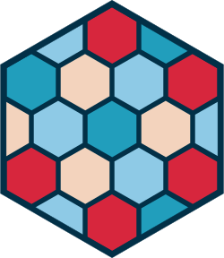

<!-- README.md is generated from README.Rmd. Please edit that file -->

```{r, include = FALSE}
knitr::opts_chunk$set(
  collapse = TRUE,
  comment = "#>",
  fig.path = "man/figures/README-",
  out.width = "100%"
)
```

# rdcmtemplate <a href="https://rdcmtemplate.r-dcm.org"></a>

<!-- badges: start -->
[](https://github.com/r-dcm/rdcmtemplate/actions/workflows/R-CMD-check.yaml)
[](https://wave.webaim.org/report#/https://rdcmtemplate.r-dcm.org)
<!-- badges: end -->

## Overview

rdcmtemplate provides a custom [pkgdown](https://pkgdown.r-lib.org) template for r-dcm packages. Please don't use it for your own package.

This package and template were inspired by [tidytemplate](https://github.com/tidyverse/tidytemplate).

## Templates

For all sites, ensure that `DESCRIPTION` contains:

```
Config/Needs/website: r-dcm/rdcmtemplate
```

### r-dcm

```yaml
template:
  package: rdcmtemplate
  bootstrap: 5
  
  includes:
    after_body: >
      <script data-goatcounter="https://{YOUR DOMAIN}.goatcounter.com/count" async src="https://gc.zgo.at/count.js"></script>
      
development:
  mode: auto
```

Ping Jake on teams to get your site added to goat counter.


### Updating

If you're updating from a previous pkgdown config, use the following checklist to make sure everything is up to date:

````md
* [ ] `usethis::use_pkgdown_github_pages()`
* [ ] Ensure Author includes University of Kansas as copyright holder
* [ ] Update `DESCRIPTION` to include `Config/Needs/website: r-dcm/rdcmtemplate`
* [ ] Update `_pkgdown.yml` with appropriate template above.
* [ ] Ping Jake to add goat counter record
* [ ] Remove `strip_header: true`
* [ ] Remove algolia search, if used
* [ ] Eliminate superseded navbar customisation (`home: ~`, article re-ordering)
* [ ] Update `news` structure if needed
* [ ] Remove any author info for r-dcm folks (since now included in template)
````
